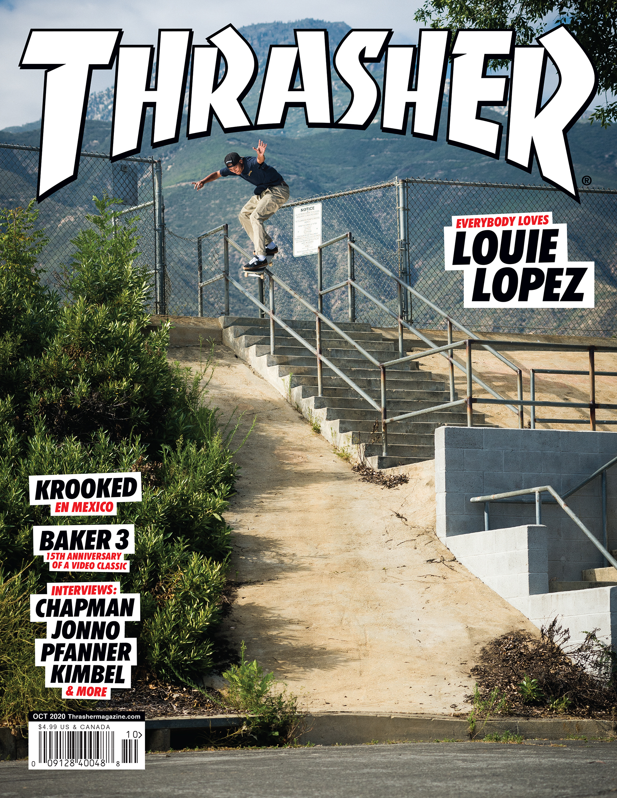

# Lucas Bajoua

***Second Year Computer Science Major***

I have not yet found my personal identity as a programmer, as I have not explored much beyond the content of the UCSD courses, but I do not feel rushed to learn faster or a victim of the impostor syndrome, as I admire the following words from Itachi Uchiha:
> Knowledge and awareness are vague, and perhaps better called illusions.

A petty reason why I dislike Java is having to type `System.out.println()` while C++ is as simple as `cout << ___`

My favorite platform for listening to music is [Soundcloud](https://soundcloud.com/discover)

See the documentation for this repository at [README](https://github.com/lucasbajoua/cse110-lab1/blob/markdown/README.md#lucas-bajouas-user-page)

Click this [link](Luffy_wanted_poster.png) to see my daily inspiration.

My hobbies include:
- Skateboarding
- Snowboarding
- Basketball
- Watching anime
- Listening to music
  
The top 3 favorite CS courses I've taken so far at UCSD are:
1. CSE 100
2. CSE 101
3. CSE 140/140L

My daily routine looks a lot like:
- [x] sleep
- [x] watch anime
- [x] skate
- [x] remember to feed myself
- [ ] try to watch the lectures from that day

